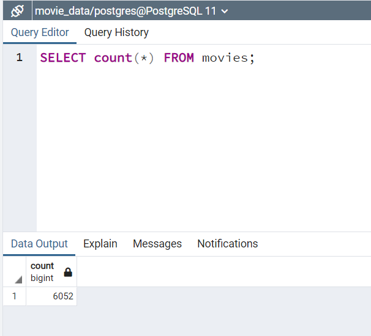
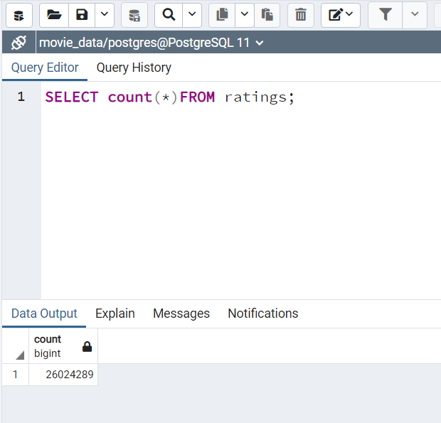

# Movies-ETL Analysis

## Overview of the Movies-ETL Analysis
**The project was created to Extract and Transform the Wikipedia Data and merge it with the Kaggle metadata in the right format while extracting the IDs using a regular
expression string and dropping duplicates, and combine important data for different analyses to use the clean data**

## Overview of Project:
To create an automated pipeline that takes in new data performs the appropriate transformations, and loads the data into existing tables.

## Results:
<b>Resources, Wikipedia data, Kaggle metadata, and the MovieLens rating data were gathered, cleaned, merged, and stored in PostgreSQL to anyone who is allowed to use it for their purposes of any</b>
	

## Summary:
Large data, such as Wikipedia with large reviewers and audiences input using different data formats were cleaned using Regular Expressions to be meaningful, consistent, and readable for the data users of any who permitted to use,
and stored in a relational database, such as PostgreSQL using its appropriate data types.

-Combining the three different sources of data, cleaning them, and stored appropriately, a total of 6,052 rows of movies were gathered and stored.

-Combining the three different sources of data, cleaning them, and stored appropriately, a total of 26,024,289 rows of rating scores were gathered and stored.

## Challenges:
<li>Using regular expressions and applied to many different cases of data sets was a very challenging process and it was the most frustrating process. </li>
<li>Different columns and similar data or data sets were very difficult to identify the common properties unless hints we were getting from the modules.  
It made me think that in the real world, it would be whole a lot difficult to clean the data without a plan</li>
